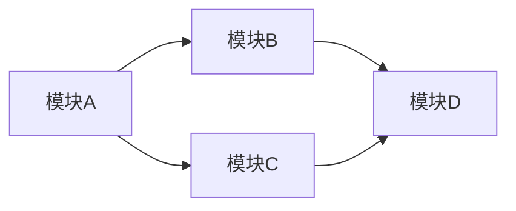
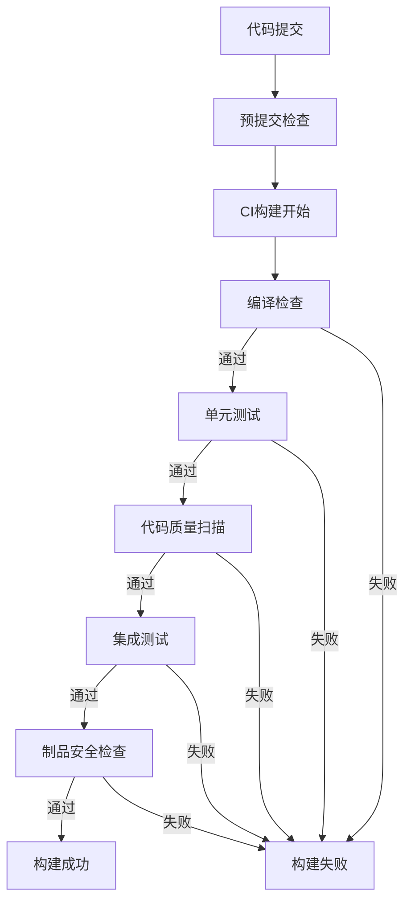
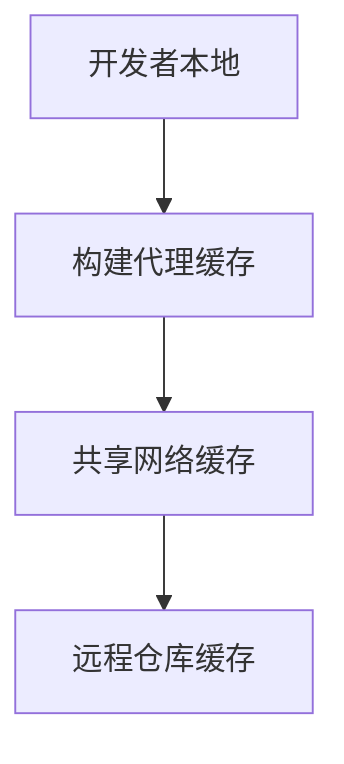

# 第5章：构建系统 - 从源码到制品的转换

## 5.1 构建过程深度解析

## 正式定义

构建过程（Build Process）是将人类可读的源代码、资源文件、配置文件等输入，通过一系列自动化步骤转换为可部署、可执行软件制品的系统化流程。这个过程包括编译、链接、打包、代码转换、资源处理、依赖解析、优化和验证等多个阶段，最终生成可直接在目标环境中运行的二进制文件、安装包或容器镜像。构建过程是软件开发生命周期中的关键转换环节，连接着开发阶段的代码编写与测试/部署阶段的制品交付。

## 通俗解释

想象一家现代化的中央厨房需要为100家连锁餐厅准备标准化的菜品：

```
原始食材（源代码） → 预处理（编译） → 烹饪加工（链接/转换） → 分装打包（打包） → 冷链配送（部署）
```

如果没有系统化的构建过程，就像让每家餐厅自己从零开始备料烹饪：
- 每家餐厅口味不一致（环境差异导致行为不同）
- 效率低下（重复劳动）
- 质量控制困难（无法统一标准）
- 新品推广慢（需要培训每家餐厅的厨师）

构建过程就是软件开发的"中央厨房生产线"，确保：
- **一致性**：无论在哪个环境构建，结果都一样
- **可重复性**：任何时候都能重现相同的制品
- **自动化**：减少人工干预，提高效率
- **标准化**：所有产出符合统一的质量标准

## 技术实现详解

### 5.1.1 构建过程的核心阶段

#### 阶段一：代码准备与验证
```
输入：源代码、配置文件、资源文件
过程：语法检查、代码质量扫描、依赖验证
输出：已验证的代码基
```

**关键技术活动**：
1. **源码获取**：从版本控制系统检出指定版本的代码
2. **依赖解析**：确定并下载项目所需的所有依赖项
3. **代码验证**：
   - 静态代码分析（Linting）
   - 代码风格检查（Style Checking）
   - 复杂度分析（Complexity Analysis）
   - 安全漏洞扫描（Security Scanning）

**测试工程师视角**：
- 在此阶段集成静态测试工具
- 建立质量门禁，阻止低质量代码进入后续流程
- 生成代码质量报告，指导测试重点

#### 阶段二：编译与转换
```
输入：源代码（Java/C#/Go等）
过程：词法分析→语法分析→语义分析→中间代码生成→优化→目标代码生成
输出：目标平台可执行代码（字节码、机器码等）
```

**编译过程深度解析**：
1. **前端编译**（语言相关）：
   ```mermaid
   源代码 → 词法分析器 → 标记流 → 语法分析器 → 抽象语法树 → 语义分析器 → 注解AST
   ```

2. **中端优化**（语言无关）：
   - 常量传播与折叠
   - 死代码消除
   - 循环优化
   - 内联展开

3. **后端生成**（平台相关）：
   - 寄存器分配
   - 指令选择
   - 指令调度
   - 代码生成

**不同类型语言的编译特点**：

| 语言类型 | 编译特点 | 输出形式 | 测试关注点 |
|---------|---------|---------|-----------|
| **编译型语言**（C/C++/Go） | 直接生成机器码 | 可执行文件/库 | 平台兼容性、性能优化效果 |
| **字节码语言**（Java/C#） | 编译为中间字节码 | .class/.dll文件 | JVM/CLR兼容性、字节码验证 |
| **解释型语言**（Python/JS） | 边解析边执行或预编译字节码 | 源码或.pyc/.js.map | 运行时兼容性、性能热点 |

#### 阶段三：资源处理与打包
```
输入：编译后的代码+资源文件（图片、配置文件、本地化文件等）
过程：资源优化、合并、压缩、版本化
输出：可部署的软件包
```

**资源处理关键技术**：
1. **资源优化**：
   - 图片压缩与格式转换
   - CSS/JS合并与最小化
   - 国际化资源提取与编译

2. **配置管理**：
   - 环境变量注入
   - 配置文件模板化
   - 敏感信息处理

3. **打包策略**：
   - **单一可执行文件**：所有依赖打包到一个文件中
   - **分离包**：主程序与依赖库分开
   - **容器化**：包含完整运行时环境的镜像

**测试关注点**：
- 资源配置的正确性和完整性
- 不同环境配置的兼容性
- 包结构的合理性和部署便利性

#### 阶段四：质量验证与制品管理
```
输入：构建出的软件制品
过程：自动化测试、安全检查、制品签名、版本标记、仓库存储
输出：已验证、可追溯的软件制品
```

**质量验证活动**：
1. **制品验证**：
   - 完整性校验（哈希值计算）
   - 安全扫描（依赖漏洞检查）
   - 合规性检查（许可证合规）

2. **自动化测试集成**：
   - 单元测试执行
   - 集成测试验证
   - 冒烟测试快速验证

3. **制品管理**：
   - 版本标记（遵循语义化版本）
   - 数字签名（确保来源可信）
   - 制品存储（存入制品仓库）

### 5.1.2 构建过程的关键概念

#### 构建环境（Build Environment）

**环境一致性挑战**：
```
问题：在我机器上能运行，为什么在服务器上不行？
原因：环境差异（操作系统、运行时版本、依赖库、环境变量）
```

**解决方案：环境标准化**：
1. **容器化构建环境**：
   ```dockerfile
   # Dockerfile构建环境定义
   FROM maven:3.8-openjdk-17 AS build
   WORKDIR /app
   COPY pom.xml .
   RUN mvn dependency:go-offline
   COPY src ./src
   RUN mvn package -DskipTests
   ```

2. **构建工具版本锁定**：
   ```gradle
   // Gradle Wrapper确保构建工具版本一致
   distributionUrl=https\://services.gradle.org/distributions/gradle-7.4-bin.zip
   ```

3. **依赖版本锁定**：
   ```json
   // package-lock.json 锁定npm依赖版本
   {
     "name": "my-app",
     "version": "1.0.0",
     "lockfileVersion": 2,
     "requires": true,
     "packages": {
       "": {
         "name": "my-app",
         "version": "1.0.0",
         "dependencies": {
           "react": "18.2.0"  # 精确版本，而非^18.2.0
         }
       }
     }
   }
   ```

#### 构建可重复性（Build Reproducibility）

**可重复构建的定义**：
给定相同的源代码、构建环境和构建参数，无论何时何地执行，都能生成完全相同的二进制输出。

**技术实现要点**：
1. **确定性构建**：
   - 固定时间戳（避免嵌入构建时间）
   - 排序文件处理（确保处理顺序一致）
   - 消除随机性（如UUID生成、随机数）

2. **构建产物验证**：
   ```bash
   # 计算构建产物的哈希值
   sha256sum target/myapp.jar
   # 相同输入应产生相同的哈希值
   ```

3. **构建缓存策略**：
   - 利用缓存避免重复计算
   - 但确保缓存不影响最终结果确定性

#### 增量构建（Incremental Build）

**增量构建原理**：
只重新构建发生变化的模块及其依赖，而非整个项目。

**依赖关系管理**：


**技术挑战**：
1. **依赖关系准确性**：需要精确的依赖分析
2. **缓存失效策略**：何时使缓存失效
3. **并行构建协调**：多个模块并行构建时的协调

### 5.1.3 构建过程的输入与输出

#### 构建输入矩阵

| 输入类型 | 内容 | 管理方式 | 版本控制 |
|---------|------|---------|---------|
| **源代码** | .java, .py, .js等源文件 | 版本控制系统 | 必需 |
| **构建脚本** | build.gradle, pom.xml, Makefile | 版本控制系统 | 必需 |
| **配置文件** | application.yml, .env, config.json | 版本控制系统 | 必需，但敏感信息除外 |
| **资源文件** | 图片、字体、音频、视频 | 版本控制系统或单独存储 | 建议 |
| **第三方依赖** | 库文件、框架、工具包 | 依赖管理工具+制品仓库 | 版本锁定文件 |
| **构建工具** | 编译器、打包工具、测试框架 | 环境配置或容器定义 | 精确版本控制 |

#### 构建输出分类

| 输出类型 | 格式示例 | 用途 | 测试关注点 |
|---------|---------|------|-----------|
| **可执行文件** | .exe, .jar, .bin | 直接运行 | 功能正确性、性能 |
| **库文件** | .dll, .so, .aar | 被其他程序调用 | API兼容性、稳定性 |
| **安装包** | .msi, .deb, .rpm | 系统安装 | 安装流程、依赖管理 |
| **容器镜像** | Docker Image, OCI Image | 容器化部署 | 镜像大小、安全性、配置 |
| **部署包** | .zip, .tar.gz, .war | 服务器部署 | 部署脚本、环境配置 |
| **文档** | API文档、用户手册 | 用户和开发者参考 | 准确性、完整性 |
| **测试报告** | JUnit XML, Coverage报告 | 质量评估 | 测试覆盖率、缺陷发现率 |

## 生活场景比喻

### 现代化中央厨房的菜品生产线

想象一家为500家连锁餐厅供应半成品菜的中央厨房：

#### 原料验收区（代码准备）
```
食材供应商（开源社区/内部团队）
    ↓
质检员（代码审查/静态分析）
    ↓
标准化仓储（版本控制仓库）
```

**关键流程**：
1. **食材标准化**：所有食材必须符合规格标准（代码规范）
2. **批次管理**：每批食材都有唯一追溯码（提交哈希）
3. **冷链物流**：确保食材在运输中不变质（代码完整性）

#### 预处理车间（编译转换）
```
蔬菜清洗线（语法检查） → 切割成型（代码转换） → 腌制调味（代码优化）
    ↓
肉类处理线（编译） → 预烹饪（链接） → 冷却定型（字节码生成）
```

**生产特点**：
- **并行流水线**：不同食材同时处理（并行编译）
- **配方标准化**：每道菜有精确的配料表（构建配置）
- **过程监控**：每个环节都有质量检查（构建验证）

#### 烹饪包装区（打包部署）
```
自动化烹饪线（构建执行） → 快速冷却（优化） → 真空包装（打包）
    ↓
贴标称重（版本标记） → 金属检测（安全扫描） → 装箱入库（制品存储）
```

**质量控制**：
- **温度时间控制**：精确控制烹饪参数（构建参数）
- **重量规格检查**：每份菜品重量一致（制品一致性）
- **保质期标签**：明确生产日期和有效期（版本信息）

#### 冷链配送系统（制品分发）
```
中央冷库（制品仓库） → 区域分拣中心（CDN节点） → 餐厅冷藏柜（运行环境）
```

**配送管理**：
- **温度全程监控**：确保冷链不断（制品完整性）
- **实时库存管理**：精准调配库存（制品版本管理）
- **快速响应机制**：紧急订单优先处理（热修复部署）

## 测试开发视角

### 构建过程对测试工作的战略意义

#### 1. 测试环境的精确复制

**构建过程确保的环境一致性**：
```yaml
# 通过构建配置定义测试环境
构建输出: 制品 + 环境定义
  包含:
    - 应用程序二进制
    - 运行时环境定义 (Dockerfile/Podmanfile)
    - 配置模板
    - 启动脚本
    - 健康检查端点
  
测试价值:
  1. 在任何环境重现问题
  2. 精确的基准测试对比
  3. 可控的测试数据注入点
```

#### 2. 自动化测试的集成点

**构建阶段集成的测试类型**：
| 构建阶段 | 集成测试类型 | 执行频率 | 反馈速度 |
|---------|------------|---------|---------|
| **编译时** | 静态分析、类型检查、代码规范 | 每次编译 | 秒级 |
| **构建时** | 单元测试、组件测试、安全扫描 | 每次构建 | 分钟级 |
| **打包后** | 集成测试、API测试、性能基准 | 主要版本构建 | 十分钟级 |
| **部署前** | 系统测试、端到端测试、负载测试 | 发布候选版本 | 小时级 |

**测试执行策略优化**：
```python
# 伪代码：基于变更分析的智能测试选择
def select_tests_for_build(changes, build_type):
    tests_to_run = set()
    
    # 基于文件变更的分析
    for file in changes:
        if file.startswith('src/auth/'):
            tests_to_run.add('auth_unit')
            tests_to_run.add('auth_integration')
            
        if file.endswith('.sql'):
            tests_to_run.add('database_migration')
    
    # 基于构建类型的策略
    if build_type == 'release':
        tests_to_run.add('full_regression')
        tests_to_run.add('performance')
    elif build_type == 'pull_request':
        tests_to_run.add('smoke')
        
    return tests_to_run
```

#### 3. 质量门禁的实施点

**构建过程中的质量检查点**：


**质量门禁指标**：
1. **编译成功率**：目标 >99%
2. **测试通过率**：目标 100%
3. **代码覆盖率**：目标 >80%（新代码>90%）
4. **安全漏洞数**：目标 0（高危/严重）
5. **构建时间**：目标 <10分钟（快速反馈）

#### 4. 测试数据与配置管理

**构建过程中处理的测试资产**：
```yaml
测试配置分层:
  构建时配置:
    - 单元测试数据库连接 (内存数据库)
    - Mock服务配置
    - 测试覆盖率收集配置
  
  集成测试配置:
    - 测试环境数据库连接
    - 外部服务桩配置
    - 性能测试参数
  
  发布测试配置:
    - 预生产环境连接
    - 真实外部服务端点
    - 监控和日志配置
```

**测试数据的版本控制**：
- 测试数据与应用程序代码同步版本
- 数据库迁移脚本作为构建的一部分
- 测试数据生成工具的输出作为制品存储

### 测试工程师在构建过程中的关键活动

#### 1. 构建验证测试（Build Verification Test, BVT）

**BVT测试套件设计原则**：
- **快速执行**：整套测试应在5-10分钟内完成
- **核心路径覆盖**：验证最基本、最关键的功能
- **环境探测**：检查部署环境的基本健康状态
- **自动化程度高**：完全自动化，无需人工干预

**BVT示例**：
```yaml
BVT测试套件:
  环境检查:
    - 数据库连接测试
    - 外部服务连通性
    - 磁盘空间检查
    
  核心功能验证:
    - 用户登录/注销
    - 主业务流程端到端
    - 关键API响应验证
    
  健康指标收集:
    - 启动时间测量
    - 内存使用基线
    - 响应时间基准
```

#### 2. 构建可观测性实施

**构建过程监控指标**：
```promql
# Prometheus监控指标示例
构建成功率 = rate(build_success_total[5m]) / rate(build_total[5m])
构建平均时间 = avg_over_time(build_duration_seconds[1h])
测试通过率 = rate(test_passed_total[5m]) / rate(test_total[5m])
制品大小变化 = delta(binary_size_bytes[24h])
```

**构建失败根本原因分析**：
```sql
-- 构建失败原因分析查询
SELECT 
    failure_reason,
    COUNT(*) as failure_count,
    AVG(time_to_fix_minutes) as avg_fix_time
FROM build_failures
WHERE build_date >= DATE_SUB(NOW(), INTERVAL 30 DAY)
GROUP BY failure_reason
ORDER BY failure_count DESC;

-- 常见失败原因分类:
-- 1. 编译错误 (语法错误、类型不匹配)
-- 2. 测试失败 (功能缺陷、环境问题)
-- 3. 依赖问题 (版本冲突、下载失败)
-- 4. 资源不足 (内存耗尽、磁盘空间不足)
```

#### 3. 测试基础设施即代码

**测试环境构建配置**：
```dockerfile
# 测试专用Dockerfile
FROM python:3.9-slim as test-base

# 安装测试依赖
RUN pip install pytest pytest-cov pytest-mock pytest-asyncio
RUN pip install requests-mock fakeredis

# 复制测试配置
COPY test_config/ /app/test_config/
COPY test_data/ /app/test_data/

# 健康检查端点
HEALTHCHECK --interval=30s --timeout=3s \
  CMD python -c "import requests; requests.get('http://localhost:8080/health')"

# 测试执行脚本
COPY run_tests.sh /app/
RUN chmod +x /app/run_tests.sh

ENTRYPOINT ["/app/run_tests.sh"]
```

## 最佳实践

### 企业级构建系统设计原则

#### 原则一：构建即代码（Build as Code）

**构建配置的版本控制**：
```
project-repo/
├── build/                    # 构建配置目录
│   ├── ci/                  # CI流水线配置
│   ├── docker/              # 容器构建配置
│   ├── scripts/             # 构建脚本
│   └── tools/               # 构建工具定义
├── src/                     # 源代码
├── tests/                   # 测试代码
├── .github/workflows/       # GitHub Actions工作流
├── .gitlab-ci.yml           # GitLab CI配置
├── Jenkinsfile              # Jenkins流水线
└── Makefile                 # 传统构建脚本
```

**构建配置模板化**：
```yaml
# 多项目共享的构建模板
defaults: &defaults
  build:
    image: company-base-build:1.0
    cache:
      paths:
        - .gradle/caches
        - .npm
    artifacts:
      paths:
        - build/libs/*.jar
        - test-reports/

project-specific:
  <<: *defaults
  variables:
    PROJECT_NAME: "user-service"
    MAVEN_OPTS: "-DskipTests=false -Dcoverage.enabled=true"
```

#### 原则二：构建过程透明化

**构建仪表板设计**：
```yaml
构建状态看板:
  实时信息:
    - 当前构建状态 (运行中/成功/失败)
    - 构建持续时间
    - 排队等待时间
  
  质量指标:
    - 测试通过率/失败率
    - 代码覆盖率趋势
    - 安全漏洞数量变化
    
  效率指标:
    - 构建频率 (提交到构建)
    - 反馈时间 (构建开始到结果)
    - 资源利用率 (CPU/内存使用)
    
  制品信息:
    - 最新版本信息
    - 部署状态
    - 回滚能力
```

**构建通知策略**：
```yaml
通知规则:
  成功构建:
    - 静默处理 (不打扰团队)
    - 记录到日志系统
    - 更新部署流水线状态
    
  失败构建:
    - 即时通知到相关开发者
    - 创建故障工单
    - 触发自动修复尝试 (如重试)
    
  性能退化:
    - 警告通知到团队负责人
    - 记录到性能趋势图
    - 触发性能测试套件
```

#### 原则三：构建缓存优化策略

**多级缓存架构**：

    
    缓存内容:
      本地: 编译结果、测试结果
      代理: 依赖下载、工具下载
      共享: Docker层缓存、构建中间产物
      远程: 制品缓存、依赖镜像
**缓存失效策略**：
```python
# 缓存键计算策略
def calculate_cache_key(source_files, dependencies, build_config):
    """计算构建缓存键，确定何时失效"""
    
    # 1. 源代码哈希
    source_hash = hash_files(source_files)
    
    # 2. 依赖版本信息
    deps_hash = hash_dependencies(dependencies)
    
    # 3. 构建配置哈希
    config_hash = hash_config(build_config)
    
    # 4. 工具版本信息
    tool_hash = hash_tool_versions()
    
    # 组合缓存键
    cache_key = f"{source_hash}-{deps_hash}-{config_hash}-{tool_hash}"
    
    return cache_key
```

### 构建过程安全最佳实践

#### 安全构建原则

**供应链安全**：
```yaml
安全检查点:
  依赖安全:
    - 依赖来源验证 (签名检查)
    - 已知漏洞扫描 (CVE数据库)
    - 许可证合规检查
  
  构建环境安全:
    - 最小权限原则 (非root用户构建)
    - 网络隔离 (构建网络与生产隔离)
    - 临时凭证管理 (自动过期)
  
  制品安全:
    - 数字签名 (防止篡改)
    - 加密存储 (敏感信息保护)
    - 访问控制 (最小必要访问)
```

**安全工具集成**：
```bash
# 构建过程中的安全检查
#!/bin/bash

# 1. 依赖漏洞扫描
npm audit --audit-level=high
if [ $? -ne 0 ]; then
    echo "发现高危依赖漏洞"
    exit 1
fi

# 2. 容器镜像扫描
docker scan myapp:latest --file Dockerfile
if [ $? -ne 0 ]; then
    echo "容器镜像存在安全风险"
    exit 1
fi

# 3. 代码安全扫描
gosec ./...
if [ $? -ne 0 ]; then
    echo "代码静态分析发现安全问题"
    exit 1
fi

# 4. 敏感信息检查
trufflehog --regex --entropy=False file://.
if [ $? -ne 0 ]; then
    echo "发现可能的敏感信息泄露"
    exit 1
fi
```

### 构建性能优化策略

#### 构建加速技术

**并行构建策略**：
```groovy
// Gradle并行构建配置
org.gradle.parallel=true
org.gradle.workers.max=4  # 根据CPU核心数调整

// 任务并行化示例
tasks.withType(JavaCompile) {
    options.fork = true
    options.incremental = true
}

// 模块并行构建
include 'module-a', 'module-b', 'module-c'
```

**增量构建优化**：
```makefile
# Makefile增量构建示例
target/app.jar: $(shell find src -name "*.java")
    @echo "编译Java源文件..."
    javac -d target/classes src/**/*.java
    jar cf target/app.jar -C target/classes .

# 只有源文件变更时才重新编译
%.class: %.java
    javac -d target/classes $<
```

**分布式构建系统**：
```yaml
# Bazel远程构建缓存配置
build:remote_cache = grpc://build-cache.company.com:8080
build:remote_executor = grpc://build-farm.company.com:8080

# 缓存命中率监控
remote_cache_hit_ratio = 0.85  # 目标85%缓存命中率
```

## 常见误区与澄清

### 误区1："构建只是编译代码"

**澄清**：现代构建过程是多阶段、全方位的转换流程：
- **质量保障阶段**：代码检查、测试执行、安全扫描
- **配置管理阶段**：环境配置注入、敏感信息处理
- **制品管理阶段**：版本标记、数字签名、仓库存储
- **部署准备阶段**：容器化、配置模板化、启动脚本生成

构建过程是软件从"开发者手中"到"用户可用"状态的关键转换点。

### 误区2："构建应该尽可能快，可以跳过测试"

**澄清**：构建速度与质量保障需要平衡：
- **分层测试策略**：快速测试在前，耗时测试在后
- **智能测试选择**：基于变更分析只运行相关测试
- **并行测试执行**：利用多机并行执行测试套件
- **测试结果缓存**：对于确定性的测试可以缓存结果

跳过关键测试可能导致质量缺陷流入后续阶段，修复成本指数级增长。

### 误区3："所有项目都应该使用相同的构建系统"

**澄清**：构建系统选择应该基于项目特性：
- **小型脚本项目**：简单脚本或Makefile足够
- **Java企业项目**：Maven或Gradle更合适
- **JavaScript前端项目**：Webpack + npm scripts
- **多语言微服务**：Bazel或CMake + 容器构建
- **数据科学项目**：Poetry或Conda + Docker

统一组织内的构建工具确实有好处，但应允许适当的灵活性。

### 误区4："构建环境应该与生产环境完全一致"

**澄清**：构建环境与生产环境的关系需要平衡：
- **一致性需求**：运行时环境（如JVM版本、Node版本）应该一致
- **工具差异**：构建工具（如编译器、打包工具）可以不同
- **安全考虑**：生产环境通常更严格，构建环境需要开发工具
- **成本优化**：构建环境可以更灵活地使用资源

最佳实践是通过容器或配置即代码确保运行时环境的一致性。

### 误区5："构建失败只需要通知提交者"

**澄清**：构建失败是团队问题，需要系统化处理：
- **即时反馈**：通知提交者立即修复
- **团队可见**：构建状态对全团队透明
- **根本原因分析**：定期分析失败模式，系统化改进
- **自动修复尝试**：对于已知的暂时性问题自动重试
- **值班响应**：对于关键路径构建失败有值班响应机制

构建稳定性是团队工程能力的直接体现。

## 关键要点总结

1. **构建过程是多阶段转换**：从源代码到可部署制品需要经过代码准备、编译转换、资源处理、质量验证等多个阶段

2. **环境一致性是构建的基石**：通过容器化、版本锁定、配置即代码确保构建环境的一致性

3. **构建可重复性是质量保障**：确定性构建确保任何时候都能重现相同的制品，支持可靠的测试和部署

4. **构建是质量门禁的关键点**：在构建过程中集成代码检查、测试执行、安全扫描等多重质量保障活动

5. **测试与构建深度集成**：构建过程提供了测试环境准备、测试执行、结果收集的关键基础设施

6. **构建性能需要系统化优化**：通过增量构建、并行构建、缓存策略等多方面优化构建性能

7. **构建安全不容忽视**：从供应链安全、构建环境安全到制品安全需要全方位的安全考虑

8. **构建过程需要透明化管理**：构建状态、质量指标、效率指标需要对团队透明，支持持续改进

9. **构建系统选择要因地制宜**：根据项目规模、技术栈、团队技能选择合适的构建工具和策略

10. **构建文化是工程文化的体现**：重视构建质量、快速反馈、持续改进的团队往往有更高的工程成熟度

## 思考问题

1. **遗留系统构建现代化改造**：假设你接手了一个10年历史的Java EE项目，当前构建过程如下：
   - 使用Ant构建脚本，2500行复杂的XML配置
   - 构建需要1.5小时，没有并行或增量构建
   - 测试执行需要额外45分钟，且经常不稳定
   - 构建环境依赖开发者的本地IDE配置
   
   作为测试开发工程师，你需要设计一个为期6个月的构建现代化改造计划。请回答：
   - 如何评估当前构建过程的主要痛点？
   - 设计渐进式的迁移策略（从Ant到Gradle/Maven）
   - 如何在不中断现有交付流程的情况下进行改造？
   - 改造后如何衡量改进效果（关键指标是什么）？

2. **多云环境下的构建系统设计**：你的组织正在向多云架构迁移，应用需要部署到AWS、Azure和Google Cloud。当前的构建系统只能生成单一环境的部署包。请设计一个支持多云部署的构建系统：
   - 如何设计构建流程以支持不同云平台的特定需求？
   - 如何管理多云环境下的配置差异？
   - 如何确保在不同云环境上构建的制品一致性？
   - 如何设计测试策略以验证多云部署的正确性？

---

**本节完成度**：✅ 5.1 构建过程深度解析 已完成  
**下节预告**：5.2 构建工具详解（Maven、Gradle、npm等）  
**生活比喻延续**：不同菜系的专用厨房设备（中餐炒锅、西餐烤箱、日餐寿司台）  
**重点内容**：各构建工具的核心概念、工作流程、适用场景对比分析